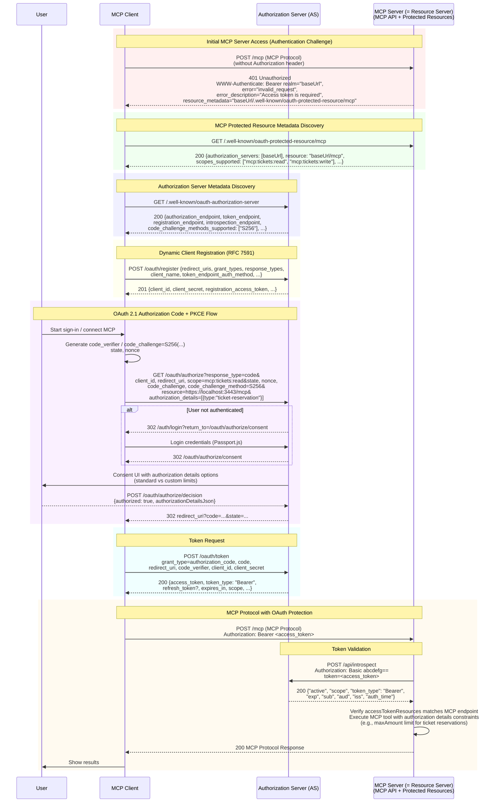

# MCP認可デモ

このプロジェクトは、MCP認可のデモを行うためのサンプルプロジェクトです。  

## 目次

- [目次](#目次)
- [1. プロジェクト概要](#1-プロジェクト概要)
- [2. ローカル環境構築](#2-ローカル環境構築)
- [3. MCP 認可フロー](#3-mcp-認可フロー)
- [4. 認可サーバーの主要なエンドポイント](#4-認可サーバーの主要なエンドポイント)
  - [4.1 認可サーバーメタデータエンドポイント](#41-認可サーバーメタデータエンドポイント)
  - [4.2 動的クライアント登録エンドポイント](#42-動的クライアント登録エンドポイント)
  - [4.3 認可エンドポイント](#43-認可エンドポイント)
  - [4.4 トークンエンドポイント](#44-トークンエンドポイント)
  - [4.5 イントロスペクションエンドポイント](#45-イントロスペクションエンドポイント)
- [Credits / Acknowledgments](#credits--acknowledgments)

## 1. プロジェクト概要

- チケット販売Webアプリケーション - Express.js + Passport.js
- MCP サーバー - OAuth 保護されたチケット操作API
- OAuth 2.1 認可サーバー - [au3te-ts-hono](https://github.com/dentsusoken/au3te-ts-hono)を利用（本プロジェクトには含まれていません。別途構築してください。）

## 2. ローカル環境構築

[こちら](./docs/local-setup.md)を参照して下さい。

## 3. MCP 認可フロー

## 4. 認可サーバーの主要なエンドポイント

### 4.1 認可サーバーメタデータエンドポイント

認可サーバーの設定情報を JSON 形式で公開するエンドポイントです。通常 `/.well-known/oauth-authorization-server` や `/.well-known/openid-configuration` というパスで提供されます。
クライアントはこの情報を取得することで、認可サーバーがサポートしている機能（スコープ、グラントタイプ、署名アルゴリズムなど）や、他の各エンドポイントの URL を動的に知ることができます。

### 4.2 動的クライアント登録エンドポイント

OAuth クライアント（アプリケーション）が、自身のメタデータ（リダイレクト URI、アプリ名、ロゴの URL など）を送信し、動的にクライアント登録を行うためのエンドポイントです。
成功すると、認可サーバーから一意のクライアント ID（および必要に応じてクライアントシークレット）や登録メタデータが返却されます。

### 4.3 認可エンドポイント

リソースオーナー（エンドユーザー）が認証を行い、クライアントへのアクセス権限の付与（認可）を承認するためのエンドポイントです。
本プロジェクトでは、標準的なスコープに加え、**Rich Authorization Requests (RAR)** を利用して構造化された詳細な権限（例：「チケット予約」の「金額上限」など）を `authorization_details` パラメータで要求します。また、`resource` パラメータで使用する MCP サーバーを特定します。

### 4.4 トークンエンドポイント

クライアントがアクセストークンを取得するために使用するエンドポイントです。サーバー間通信（バックチャネル）で利用されます。
認可コードフローでは、認可エンドポイントで取得した「認可コード」をこのエンドポイントに送信し、引き換えに「アクセストークン」（および ID トークン、リフレッシュトークン）を受け取ります。

### 4.5 イントロスペクションエンドポイント

リソースサーバー（MCP サーバー）が、提示されたアクセストークンの有効性やメタデータを確認するために使用するエンドポイントです。
MCP サーバーはこのエンドポイントからの応答に含まれる `authorization_details` を確認し、MCP ツールの実行が許可されているか、またユーザーが設定した制約（例：購入枚数制限）内であるかを判断して、ツールの実行制御を行います。

## Credits / Acknowledgments

このプロジェクトは、以下のリポジトリをフォークして作成しました。

- **Original Repository**: [authlete-study-session-2025-08](https://github.com/watahani/authlete-study-session-2025-08)
- **Author**: [watahani](https://github.com/watahani)
