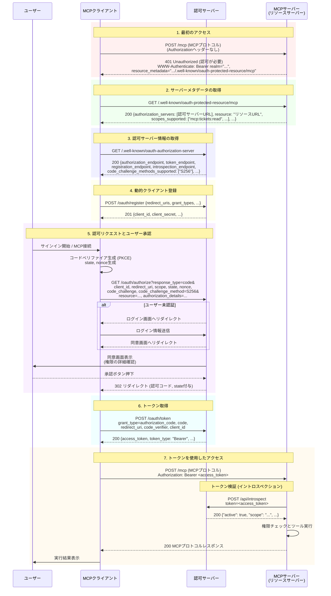
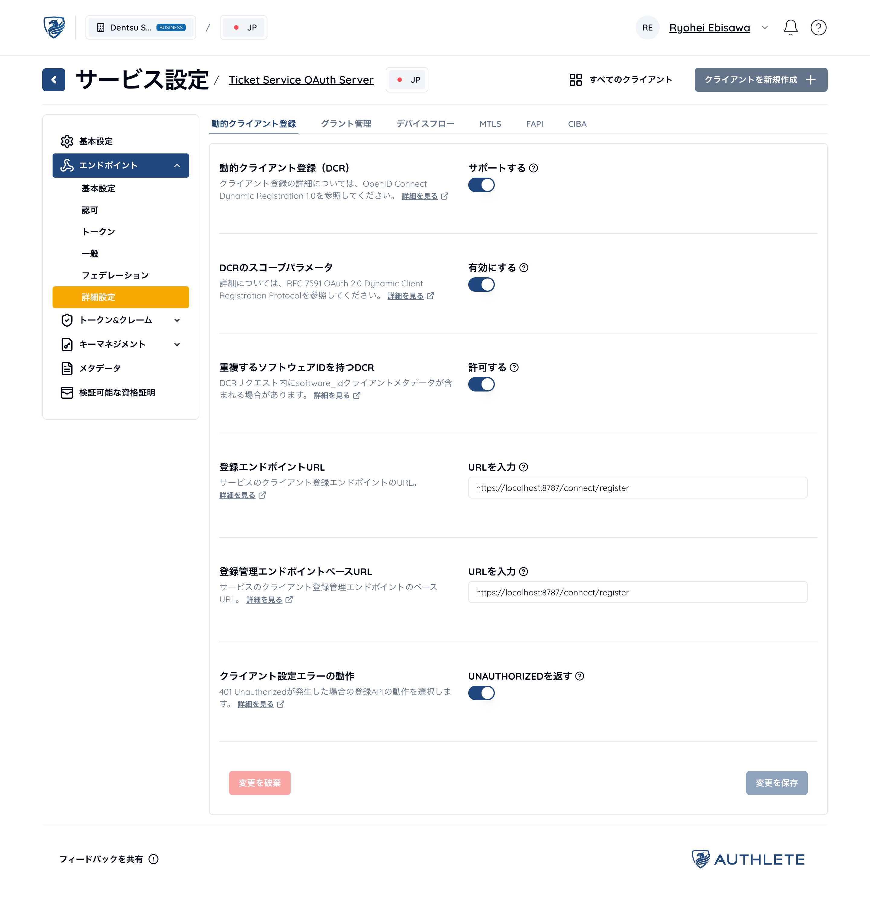
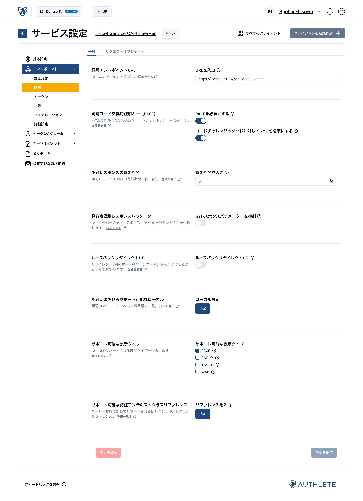
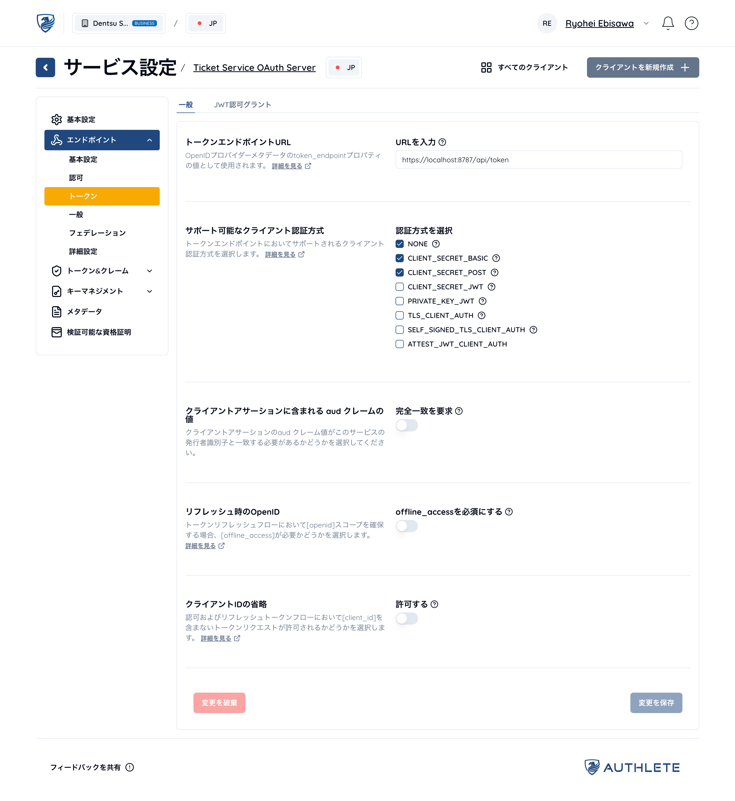
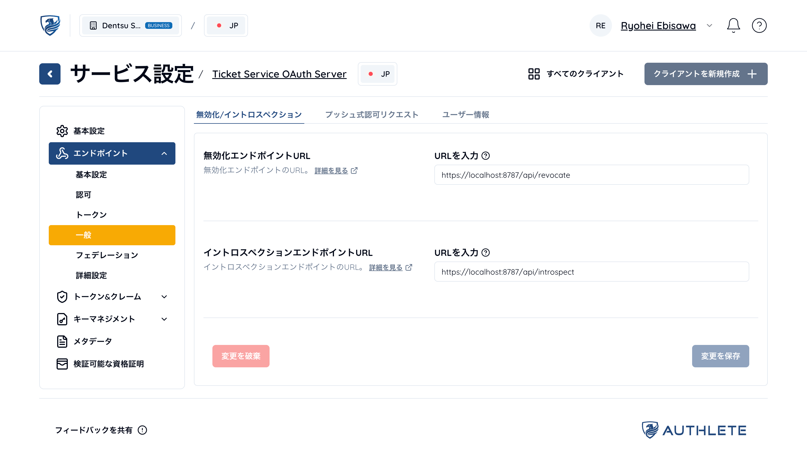

# MCP認可デモ

このプロジェクトは、MCP認可のデモを行うためのサンプルプロジェクトです。
OAuth 2.0 / 2.1 に基づく認可フローを利用し、MCP クライアントが MCP サーバー（リソースサーバー）上の保護されたリソースに安全にアクセスする仕組みを実証します。
Authlete を認可サーバーに利用しています。

## 目次

- [1. システム構成](#1-システム構成)
- [2. ローカル環境構築](#2-ローカル環境構築)
  - [2.1. リポジトリのクローン](#21-リポジトリのクローン)
  - [2.2. 依存パッケージのインストール](#22-依存パッケージのインストール)
- [3. MCP 認可フロー](#3-mcp-認可フロー)
- [4. MCP 認可フローの動作確認](#4-mcp-認可フローの動作確認)
  - [4.1. ローカルMCPサーバーの起動](#41-ローカルサーバーの起動)
  - [4.2. curlコマンドを使用した動作確認手順](#42-curlコマンドを使用した動作確認手順)
    - [4.2.1. 最初のアクセス（Authorizationヘッダーなし）](#421-最初のアクセスauthorizationヘッダーなし)
    - [4.2.2. リソースサーバー（MCPサーバー）のメタデータを取得する](#422-リソースサーバーmcpサーバーのメタデータを取得する)
    - [4.2.3. 認可サーバーのメタデータを取得する](#423-認可サーバーのメタデータを取得する)
    - [4.2.4. クライアントを登録する（動的クライアント登録）](#424-クライアントを登録する動的クライアント登録)
    - [4.2.5. 認可リクエストを実行する（ブラウザでの承認）](#425-認可リクエストを実行するブラウザでの承認)
    - [4.2.6. トークンリクエストを実行する](#426-トークンリクエストを実行する)
    - [4.2.7. トークンを使ってMCPサーバーにリクエストする](#427-トークンを使ってmcpサーバーにリクエストする)
    - [4.2.8. トークンの検証（MCPサーバーの動作確認）](#428-トークンの検証mcpサーバーの動作確認)
- [5. 認可サーバーの主要なエンドポイント](#5-認可サーバーの主要なエンドポイント)
  - [5.1. 認可サーバーメタデータエンドポイント](#51-認可サーバーメタデータエンドポイント)
    - [パスコンポーネントが必要な場合](#パスコンポーネントが必要な場合)
    - [パスコンポーネントが不要な場合](#パスコンポーネントが不要な場合)
  - [5.2. 動的クライアント登録エンドポイント](#52-動的クライアント登録エンドポイント)
  - [5.3. 認可エンドポイント](#53-認可エンドポイント)
  - [5.4. トークンエンドポイント](#54-トークンエンドポイント)
  - [5.5. イントロスペクションエンドポイント](#55-イントロスペクションエンドポイント)
- [6. Authleteコンソール上での各エンドポイントの設定例](#6-authleteコンソール上での各エンドポイントの設定例)
  - [6.1. 動的クライアント登録エンドポイント](#61-動的クライアント登録エンドポイント)
  - [6.2. 認可エンドポイント](#62-認可エンドポイント)
  - [6.3. トークンエンドポイント](#63-トークンエンドポイント)
  - [6.4. イントロスペクションエンドポイント](#64-イントロスペクションエンドポイント)
- [Credits / Acknowledgments](#credits--acknowledgments)

## 1. システム構成

- チケット販売Webアプリケーション - Express.js + Passport.js
- MCP サーバー - OAuth 保護されたチケット操作API
- OAuth 2.1 認可サーバー - [au3te-ts-hono](https://github.com/dentsusoken/au3te-ts-hono)を利用（本プロジェクトには含まれていません。別途構築してください。）

## 2. ローカル環境構築

### 2.1. リポジトリのクローン

```bash
git clone https://github.com/ryohei-ebisawa/mcp-authorization-demo.git
cd mcp-authorization-demo
```

### 2.2. 依存パッケージのインストール

```bash
npm install
```

> [!NOTE]
> デモのためSSL/TLS通信をローカル環境で使用するためのセットアップは実施しません。

## 3. MCP 認可フロー

本デモで体験するMCP認可の全体フローです。
**OAuth 2.1 認可コードフロー** に基づき、MCPクライアントがユーザーの承認を得てアクセストークンを取得し、最終的にMCPサーバー上のリソースを利用するまでの流れを示しています。



## 4. MCP 認可フローの動作確認

前述のフロー図で示した流れを、実際に手を動かして確認してみましょう。

### 4.1. ローカルMCPサーバーの起動

```bash
sh ./scripts/launch-local-server.sh
```

### 4.2. curlコマンドを使用した動作確認手順

ここでは、ターミナルで `curl` コマンドを使い、実際にサーバーと通信しながら認可の流れを体験します。
「MCPクライアント」が、まだ権限を持っていない状態からスタートし、最終的に「アクセストークン」を手に入れて「MCPサーバー」の機能を使えるようになるまでのステップを順に追っていきます。

この手順では、`curl`コマンドおよび`openssl`コマンドを使用します。
それぞれのコマンドがインストールされていない場合は、インストールしてください。
以下のコマンドでインストール済みかを確認できます。(インストール済みの場合は各コマンドのバージョンが表示されます。)

```bash
curl -V
# curl 8.7.1

openssl -v
# OpenSSL 3.5.0
```

#### 4.2.1. 最初のアクセス（Authorizationヘッダーなし）

まずは、**何の権限（アクセストークン）も持たずに** MCPサーバーにアクセスしてみます。
MCPサーバーが保護されている場合、サーバーは「誰ですか？権限がありません」と拒否します（HTTP 401 Unauthorized）。

しかし、この拒否レスポンスには重要なヒントが含まれています。
「アクセスするにはトークンが必要です。トークンを発行するための情報はここにありますよ」という案内（`WWW-Authenticate` ヘッダー）が返ってくるのです。

**実行するコマンド:**

```bash
# リクエスト
curl -iX POST http://localhost:3443/mcp \
    -H "Accept: application/json, text/event-stream" \
    -H "Content-Type: application/json" \
    -d '{"method":"notifications/initialized","jsonrpc":"2.0"}'
```

**結果の確認:**

レスポンスヘッダーの `WWW-Authenticate` の部分に注目してください。

```bash
# レスポンス（抜粋）
HTTP/1.1 401 Unauthorized
...
WWW-Authenticate: Bearer realm="http://localhost:3443", ...,
  resource_metadata="http://localhost:3443/.well-known/oauth-protected-resource/mcp", ...
  scope="mcp:tickets:read"
  , ...
```

ここにある `resource_metadata` がMCPサーバーのメタデータを取得するURLです。
`scope`がこのAPI呼び出しに必要なスコープです。

#### 4.2.2. リソースサーバー（MCPサーバー）のメタデータを取得する

前のステップで確認した `resource_metadata` のURLにアクセスして、**このサーバーの詳細情報（メタデータ）** を取得します。
ここには、「このMCPサーバーを使うためのアクセストークンは、どの認可サーバーで発行できるか」という情報が書かれています。

**実行するコマンド:**

```bash
# リクエスト
curl -i http://localhost:3443/.well-known/oauth-protected-resource/mcp
```

**結果の確認:**

レスポンス（JSON）の中に `authorization_servers` という項目があります。

```json
{
  "resource": "http://localhost:3443/mcp",
  "authorization_servers": ["https://vc-issuer.g-trustedweb.workers.dev"],
  ...
}
```

このURL（`https://vc-issuer.g-trustedweb.workers.dev`）が、今回利用する**認可サーバー**です。


#### 4.2.3. 認可サーバーのメタデータを取得する

認可サーバーのURLがわかったので、次はそのメタデータを調べます。
認可サーバーのURLの後ろに `/.well-known/oauth-authorization-server` を付けてアクセスすると、認可サーバーのメタデータが取得できます。

**実行するコマンド:**

```bash
# リクエスト
curl -i https://vc-issuer.g-trustedweb.workers.dev/.well-known/oauth-authorization-server
```

**結果の確認:**

レスポンス（JSON）から、以下の3つのURLを確認します。これらが後の手順で使うエンドポイントです。

- `registration_endpoint`: MCPクライアントを登録するエンドポイント (`.../connect/register`)
- `authorization_endpoint`: ユーザーの認可/認証を行うページのURL (`.../api/authorization`)
- `token_endpoint`: 認可コードをトークンに交換するエンドポイント (`.../api/token`)

```json
{
  "issuer": "https://vc-issuer.g-trustedweb.workers.dev",
  "authorization_endpoint": "https://vc-issuer.g-trustedweb.workers.dev/api/authorization",
  "token_endpoint": "https://vc-issuer.g-trustedweb.workers.dev/api/token",
  "registration_endpoint": "https://vc-issuer.g-trustedweb.workers.dev/connect/register",
  ...
}
```

#### 4.2.4. クライアントを登録する（動的クライアント登録）

認可サーバーを利用するには、まず、クライアント登録する必要があります。
事前に手動登録することもありますが、今回は**その場で自動的に登録する仕組み（動的クライアント登録）** を利用します。
MCPクライアントは、事前に手動登録できないことも多いためです。

認可サーバーの登録エンドポイントに対して登録リクエストを送ります。

**実行するコマンド:**

```bash
# リクエスト
curl -iX POST https://vc-issuer.g-trustedweb.workers.dev/connect/register \
    -H "Content-Type: application/json" \
    -d '{
            "redirect_uris": ["http://localhost:9999/oauth/callback/debug"],
            "token_endpoint_auth_method": "none",
            "grant_types": ["authorization_code", "refresh_token"],
            "response_types": ["code"],
            "client_name": "MCP Client",
            "client_uri": "http://localhost:9999/oauth",
            "scope": "mcp:tickets:read mcp:tickets:write"
        }'
```

**結果の確認と変数の設定:**

レスポンスに含まれる `client_id` が**クライアントID**です。

```json
{
  ...
  "client_id": "1687054126",
  ...
}
```

この `client_id`の値 （例：`1687054126`）をコピーして、変数 `CLIENT_ID` に設定します。

```bash
# 【入力】レスポンスの client_id の値をセットします
CLIENT_ID="YOUR_CLIENT_ID"
```

#### 4.2.5. 認可リクエストを実行する（ブラウザでの承認）

ここからはコマンドではなく、**Webブラウザ**を使います。
ユーザーがログインし、「このクライアントに権限を与えてもよい」と認可するプロセスです。

以下の**URLを生成するコマンド**を実行し、表示されたURLをコピーしてください。

**URLを生成するコマンド:**

MCP認可では、OAuth 2.1 に準拠した Authorization Code Flow を使うことが前提になっており、その中で PKCE 実装が必須とされています。そのため、CODE_VERIFIERとCODE_CHALLENGEを用意します。

```bash
# Code Verifier (ランダム文字列) の生成
CODE_VERIFIER=$(openssl rand -base64 32 | tr '+/' '-_' | tr -d '=')

# Code Challenge (Verifierのハッシュ値) の生成
CODE_CHALLENGE=$(echo -n "$CODE_VERIFIER" | openssl sha256 -binary | openssl base64 | tr '+/' '-_' | tr -d '=')

# 認可リクエスト用URLを生成して表示します
AUTH_URL="https://vc-issuer.g-trustedweb.workers.dev/api/authorization"
AUTH_PARAMS="response_type=code"
AUTH_PARAMS="$AUTH_PARAMS&client_id=$CLIENT_ID"
AUTH_PARAMS="$AUTH_PARAMS&code_challenge=$CODE_CHALLENGE"
AUTH_PARAMS="$AUTH_PARAMS&code_challenge_method=S256"
AUTH_PARAMS="$AUTH_PARAMS&redirect_uri=http%3A%2F%2Flocalhost%3A9999%2Foauth%2Fcallback%2Fdebug"
AUTH_PARAMS="$AUTH_PARAMS&state=random_state_value"
AUTH_PARAMS="$AUTH_PARAMS&scope=mcp%3Atickets%3Aread+mcp%3Atickets%3Awrite"
AUTH_PARAMS="$AUTH_PARAMS&resource=http%3A%2F%2Flocalhost%3A3443%2Fmcp"
echo "$AUTH_URL?$AUTH_PARAMS"
```

**ブラウザでの操作:**

1. 上記コマンドで表示された `https://...` から始まるURLをコピーし、ブラウザでアクセスします。
2. 同意画面が表示されたら、以下の認証情報を入力して`Authorize`（承認）ボタンをクリックします。
   - **ID**: `inga`
   - **PW**: `inga`

**結果の確認と変数の設定:**

承認が終わると、画面が切り替わるか、指定したURL（localhost）にリダイレクトされます。
その際、ブラウザのアドレスバー（または画面表示）にある `code=` の後ろの文字列が重要です。これが**認可コード**です。

```bash
http://localhost:9999/oauth/callback/debug?state=...&code=MggNs47bcav...&iss=...
```

この `code` の値（`&`の前まで）をコピーして、変数 `CODE` に設定します。

```bash
# 【入力】ブラウザで取得した認可コードをセットします
CODE="YOUR_CODE"
```

#### 4.2.6. トークンリクエストを実行する

手に入れた「認可コード」を使って、ついに**アクセストークン**を受け取ります。
これまで設定してきた変数 `$CODE`、`$CLIENT_ID` を使うので、コマンドの書き換えは不要です。

**実行するコマンド:**

```bash
# リクエスト
curl -iX POST https://vc-issuer.g-trustedweb.workers.dev/api/token \
    -H "Content-Type: application/x-www-form-urlencoded" \
    -d "grant_type=authorization_code" \
    -d "code=$CODE" \
    -d "code_verifier=$CODE_VERIFIER" \
    -d "redirect_uri=http%3A%2F%2Flocalhost%3A9999%2Foauth%2Fcallback%2Fdebug" \
    -d "resource=http%3A%2F%2Flocalhost%3A3443%2Fmcp" \
    -d "client_id=$CLIENT_ID"
```

**結果の確認と変数の設定:**

成功すると、レスポンス（JSON）に `access_token` が含まれています。これが**目的のアクセストークン**です。

```json
{
  "access_token": "IU7JGeoJxJSGfAY7nT9A-kK4GAGQgenvHtaRbaUcwoU",
  "token_type": "Bearer",
  ...
}
```

このトークン（例：`IU7JGeo...`）をコピーして、変数 `ACCESS_TOKEN` に設定します。

```bash
# 【入力】レスポンスの access_token の値をセットします
ACCESS_TOKEN="YOUR_ACCESS_TOKEN"
```

#### 4.2.7. トークンを使ってMCPサーバーにリクエストする

最後に、手に入れた「アクセストークン」を使って、最初に拒否されたリクエストにもう一度挑戦します。
変数 `$ACCESS_TOKEN` をヘッダーに埋め込んで送信します。

**実行するコマンド:**

```bash
# リクエスト
curl -iX POST http://localhost:3443/mcp \
    -H "Authorization: Bearer $ACCESS_TOKEN" \
    -H "Accept: application/json, text/event-stream" \
    -H "Content-Type: application/json" \
    -d '{"method":"notifications/initialized","jsonrpc":"2.0"}'
```

今度は `401 Unauthorized` ではなく、`202 Accepted`（または `200 OK`）が返ってくるはずです。
これで、認可された状態でMCPサーバーへアクセスできることが確認できました。

#### 4.2.8. トークンの検証（MCPサーバーの動作確認）

最後に、**MCPサーバーの視点**で、送られてきたアクセストークンが有効かどうかを検証する手順を確認します。
本来、この処理は3.2.7のリクエストを受け取ったMCPサーバーが裏側で自動的に行っていますが、ここでは手動でコマンドを実行してその仕組みを体験します。

MCPサーバーは、認可サーバーの「イントロスペクションエンドポイント」にトークンを送り、その有効性を問い合わせます。
`mcp-server:mcp-server-secret`は今回のデモ用に用意した、リソースサーバーのユーザー名とパスワードです。

**実行するコマンド:**

```bash
# リクエスト
curl -iX POST https://vc-issuer.g-trustedweb.workers.dev/api/introspect \
    -u "mcp-server:mcp-server-secret" \
    -H "Content-Type: application/x-www-form-urlencoded" \
    -d "token=$ACCESS_TOKEN"
```

**結果の確認:**

レスポンス（JSON）の `active` プロパティを確認します。
`true` であれば、このトークンは有効であり、MCPサーバーはクライアントからのリクエストを受け入れます。
また、トークンに紐付いている権限（`scope`）や有効期限（`exp`）などの詳細情報も確認できます。

```json
{
  "active": true,
  "scope": "mcp:tickets:read mcp:tickets:write",
  "client_id": "...",
  "token_type": "Bearer",
  "exp": 1737013895,
  "iat": 1737010295,
  "sub": "1004",
  "aud": ["http://localhost:3443/mcp"],
  "iss": "https://vc-issuer.g-trustedweb.workers.dev"
}
```

## 5. 認可サーバーの主要なエンドポイント

ここでは、MCP 認可フローで登場する認可サーバーの主要なエンドポイントについて解説します。

### 5.1. 認可サーバーメタデータエンドポイント

認可サーバーの設定情報（メタデータ）をJSON形式で公開するエンドポイントです。
クライアントは、まずこのエンドポイントにアクセスして、「どこに認可リクエストを送ればいいか」「どの署名アルゴリズムが使えるか」などの情報を取得します。

[RFC8414](https://datatracker.ietf.org/doc/html/rfc8414)（OAuth 2.0 Authorization Server Metadata）および、[OpenID Connect Discovery 1.0](https://openid.net/specs/openid-connect-discovery-1_0.html)で仕様が定義されています。
メタデータは`/.well-known/oauth-authorization-server` や `/.well-known/openid-configuration` という決まったパスで公開されます。

MCPクライアントは、以下の順にリクエストを行い、最初に見つかったメタデータを使用します。

#### パスコンポーネントが必要な場合

（例：`https://example.com/tenant-a` のようなテナント別のURLの場合）

1. OAuth 2.0 Authorization Server Metadata: `https://example.com/.well-known/oauth-authorization-server/tenant-a`
2. OpenID Connect Discovery 1.0 (path insertion): `https://example.com/.well-known/openid-configuration/tenant-a`
3. OpenID Connect Discovery 1.0 (path appending): `https://example.com/tenant-a/.well-known/openid-configuration`

#### パスコンポーネントが不要な場合

1. OAuth 2.0 Authorization Server Metadata: `https://example.com/.well-known/oauth-authorization-server`
2. OpenID Connect Discovery 1.0: `https://example.com/.well-known/openid-configuration`

### 5.2. 動的クライアント登録エンドポイント

クライアント（アプリケーション）が、自分自身の情報を登録するためのエンドポイントです。
[RFC7591](https://datatracker.ietf.org/doc/html/rfc7591)で仕様が定義されています。

通常、OAuthクライアントを利用するには事前の登録が必要ですが、MCPのように「ユーザーが任意のサーバーに接続したい」という場面では、事前に全てのクライアントを登録しておくことは不可能です。
そこで、接続時に動的にクライアント登録を行うことで、シームレスな利用を実現します。成功すると、一意のクライアントIDが発行されます。

### 5.3. 認可エンドポイント

ユーザー（リソースオーナー）が、「このアプリに権限を与えてもよいか」を確認し、承認するためのエンドポイントです。
OAuth 2.1（[draft-ietf-oauth-v2-1-13](https://datatracker.ietf.org/doc/html/draft-ietf-oauth-v2-1-13)）で仕様が定義されています。

MCPの文脈では、以下のパラメータが特に重要です。

- **`resource`**: どのMCPサーバー（リソースサーバー）にアクセスしたいかを指定します。
- **`code_challenge` / `code_challenge_method`**: **PKCE (Proof Key for Code Exchange)** のためのパラメータです。MCPの仕様では、認可コード横領攻撃を防ぐためにPKCEの実装が**必須**となっており、`S256`（SHA-256）方式の使用が求められます。

### 5.4. トークンエンドポイント

認可コードをアクセストークンと交換するためのエンドポイントです。
OAuth 2.1（[draft-ietf-oauth-v2-1-13](https://datatracker.ietf.org/doc/html/draft-ietf-oauth-v2-1-13)）で仕様が定義されています。

クライアントは、認可エンドポイントで取得した「認可コード」と、PKCE用の「Code Verifier」などを送信し、アクセストークンを取得します。
また、ここでも `resource` パラメータを指定して、特定のMCPサーバー向けのトークンであることを明示する必要があります。

### 5.5. イントロスペクションエンドポイント

トークンの有効性や内容を検証するためのエンドポイントです。
[RFC7662](https://datatracker.ietf.org/doc/html/rfc7662)で仕様が定義されています。

これは主に**MCPサーバー（リソースサーバー）が使用します**。
MCPサーバーは、クライアントから送られてきたアクセストークンが本物かどうか、期限切れではないか、どのような権限（スコープ）を持っているかを、このエンドポイントに問い合わせて確認します。
これにより、トークン自体に情報を詰め込まない「リファレンストークン」形式でも安全に検証が可能になります。

## 6. Authleteコンソール上での各エンドポイントの設定例

### 6.1. 動的クライアント登録エンドポイント



### 6.2. 認可エンドポイント



### 6.3. トークンエンドポイント



### 6.4. イントロスペクションエンドポイント



## Credits / Acknowledgments

このプロジェクトは、以下のリポジトリをフォークして作成しました。

- **Original Repository**: [authlete-study-session-2025-08](https://github.com/watahani/authlete-study-session-2025-08)
- **Author**: [watahani](https://github.com/watahani)
