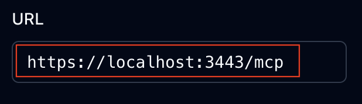
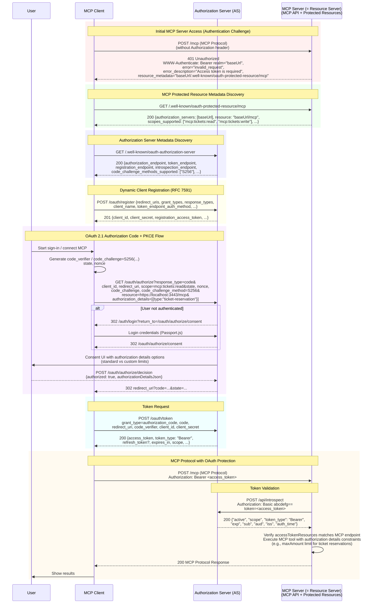

# MCP認可デモ

このプロジェクトは、MCP認可のデモを行うためのサンプルプロジェクトです。
OAuth 2.0 / 2.1 に基づく認可フローを利用し、MCP クライアントが MCP サーバー（リソースサーバー）上の保護されたリソースに安全にアクセスする仕組みを実証します。
Authlete をバックエンドに利用した認可サーバーと連携し、詳細な認可制御（Rich Authorization Requests）や動的クライアント登録（Dynamic Client Registration）の動作を確認できます。

## 目次

- [1. システム構成](#1-システム構成)
- [2. ローカル環境構築](#2-ローカル環境構築)
- [3. 各エンドポイントの動作確認](#3-各エンドポイントの動作確認)
  - [3.1 ローカルサーバーの起動](#31-ローカルサーバーの起動)
  - [3.2 確認手順](#32-確認手順)
- [4. MCP 認可フロー](#4-mcp-認可フロー)
- [5. 認可サーバーの主要なエンドポイント](#5-認可サーバーの主要なエンドポイント)
  - [5.1 認可サーバーメタデータエンドポイント](#51-認可サーバーメタデータエンドポイント)
    - [パスコンポーネントが必要な場合](#パスコンポーネントが必要な場合)
    - [パスコンポーネントが不要な場合](#パスコンポーネントが不要な場合)
  - [5.2 動的クライアント登録エンドポイント](#52-動的クライアント登録エンドポイント)
  - [5.3 認可エンドポイント](#53-認可エンドポイント)
  - [5.4 トークンエンドポイント](#54-トークンエンドポイント)
  - [5.5 イントロスペクションエンドポイント](#55-イントロスペクションエンドポイント)
- [6. Authleteコンソール上での各エンドポイントの設定例](#6-authleteコンソール上での各エンドポイントの設定例)
  - [6.1. 動的クライアント登録エンドポイント](#61-動的クライアント登録エンドポイント)
  - [6.2. 認可エンドポイント](#62-認可エンドポイント)
  - [6.3. トークンエンドポイント](#63-トークンエンドポイント)
  - [6.4. イントロスペクションエンドポイント](#64-イントロスペクションエンドポイント)
- [Credits / Acknowledgments](#credits--acknowledgments)

## 1. システム構成

- チケット販売Webアプリケーション - Express.js + Passport.js
- MCP サーバー - OAuth 保護されたチケット操作API
- OAuth 2.1 認可サーバー - [au3te-ts-hono](https://github.com/dentsusoken/au3te-ts-hono)を利用（本プロジェクトには含まれていません。別途構築してください。）

## 2. ローカル環境構築

> [!IMPORTANT]
> 環境構築の詳細手順は [こちら](./docs/local-setup.md) を参照して下さい。

## 3. 各エンドポイントの動作確認

### 3.1 ローカルサーバーの起動

```bash
sh ./scripts/launch-local-server.sh
```
Terminalに下記のようなログが出力されていると思います。このSession Tokenはあとで使います。MCP Inspectorを起動してください
```sh
...
[INSPECT] ⚙️ Proxy server listening on 127.0.0.1:6277
[INSPECT] 🔑 Session token: ccc4afe2ed60d257edcd2d2c9dc6f757194506a7ca24044f8403569c52a38361
...
[INSPECT] 🔍 MCP Inspector is up and running at http://127.0.0.1:6274 🚀
```

### 3.2 確認手順

1. MCP Inspectorの画面で「Open Auth Settings」をクリック。
   
2. Auth Settings画面上部の「Quick OAuth Flow」をクリック
   
3. 認可画面が表示されたら認証情報を入力
4. MCP Inspectorの画面に戻ってきたら画面下部から各エンドポイントの実行結果が確認できます。
   

> [!TIP]
> Auth Settings画面の下部にある「Continue」ボタンをクリックすることでフローをステップバイステップで実行できます。
> 

5. 「Authentication Complete」のアコーディオンを開いてアクセストークンを取得
   
6. 以下のコマンドを実行してIntrospectionエンドポイントにリクエスト
    ```bash
    curl -X POST https://<au3te-ts-hono_domain>/api/introspect \
        -u "mcp-server:mcp-server-secret" \
        -d "token=<access_token>"

    #  {"active":true,"scope": ...
    ```

## 4. MCP 認可フロー



## 5. 認可サーバーの主要なエンドポイント

### 5.1 認可サーバーメタデータエンドポイント

認可サーバーの設定情報（メタデータ）をJSON形式で公開するエンドポイントです。
[RFC8414](https://datatracker.ietf.org/doc/html/rfc8414)（OAuth 2.0 Authorization Server Metadata）および、[OpenID Connect Discovery 1.0](https://openid.net/specs/openid-connect-discovery-1_0.html)で仕様が定義されています。
メタデータは`/.well-known/oauth-authorization-server` や `/.well-known/openid-configuration` というWell-Known URIを利用して公開されます。

MCPクライアントは、以下の順にリクエストを行いメタデータが取得できるか試みます。

#### パスコンポーネントが必要な場合

1. OAuth 2.0 Authorization Server Metadata with path insertion: `https://example.com/.well-known/oauth-authorization-server/**path**`
2. OpenID Connect Discovery 1.0 with path insertion: `https://example.com/.well-known/openid-configuration/**path**`
3. OpenID Connect Discovery 1.0 with path appending: `https://example.com/**path**/.well-known/openid-configuration`

#### パスコンポーネントが不要な場合

1. OAuth 2.0 Authorization Server Metadata: `https://example.com/.well-known/oauth-authorization-server`
2. OpenID Connect Discovery 1.0: `https://example.com/.well-known/openid-configuration`

### 5.2 動的クライアント登録エンドポイント

OAuth クライアント（アプリケーション）が、自身のメタデータ（リダイレクト URI、アプリ名、ロゴの URL など）を送信し、動的にクライアント登録を行うためのエンドポイントです。[RFC7591](https://datatracker.ietf.org/doc/html/rfc7591)で仕様が定義されています。
成功すると、認可サーバーから一意のクライアント ID（および必要に応じてクライアントシークレット）や登録メタデータが返却されます。

多くの場合、MCPクライアントは事前にMCPサーバーの認可サーバーについての情報を持っておらず、また手動での登録作業はユーザーにとって抵抗があります。
動的クライアント登録の仕組みを利用することでMCPクライアントは新たなMCPサーバーおよびその認可サーバーとシームレスに接続することが可能になります。

### 5.3 認可エンドポイント

リソースオーナー（エンドユーザー）が認証を行い、クライアントへのアクセス権限の付与（認可）を承認するためのエンドポイントです。OAuth2.1（[draft-ietf-oauth-v2-1-13](https://datatracker.ietf.org/doc/html/draft-ietf-oauth-v2-1-13)）で仕様が定義されています。
本プロジェクトでは、標準的なスコープに加え、**Rich Authorization Requests (RAR)** を利用して構造化された詳細な権限（例：「チケット予約」の「金額上限」など）を `authorization_details` パラメータで要求します。また、`resource` パラメータで使用する MCP サーバーを特定する必要があります。

### 5.4 トークンエンドポイント

クライアントがアクセストークンを取得するために使用するエンドポイントです。OAuth2.1（[draft-ietf-oauth-v2-1-13](https://datatracker.ietf.org/doc/html/draft-ietf-oauth-v2-1-13)）で仕様が定義されています。
認可エンドポイントで取得した「認可コード」をこのエンドポイントに送信し、引き換えに「アクセストークン」（および ID トークン、リフレッシュトークン）を受け取ります。また、リクエスト時には`resource` パラメータで使用する MCP サーバーを特定する必要があります。（`resource`パラメータの値は認可エンドポイントにリクエストする際と同じです。）

### 5.5 イントロスペクションエンドポイント

リソースサーバー（MCP サーバー）が、提示されたアクセストークンの有効性やメタデータを確認するために使用するエンドポイントです。[RFC7662](https://datatracker.ietf.org/doc/html/rfc7662)で仕様が定義されています。
MCP サーバーはMCPクライアントから受け取ったアクセストークンが有効なものであるかを検証する必要があります。
アクセストークンにはリファレンストークンと自己エンコードトークンの２種類があり、リファレンストークンの場合はトークン自体に有効性を確認する機能が存在せず、本エンドポイントを利用することでトークンの有効性を検証することができます。

## 6. Authleteコンソール上での各エンドポイントの設定例

### 6.1. 動的クライアント登録エンドポイント


### 6.2. 認可エンドポイント


### 6.3. トークンエンドポイント


### 6.4. イントロスペクションエンドポイント


## Credits / Acknowledgments

このプロジェクトは、以下のリポジトリをフォークして作成しました。

- **Original Repository**: [authlete-study-session-2025-08](https://github.com/watahani/authlete-study-session-2025-08)
- **Author**: [watahani](https://github.com/watahani)
